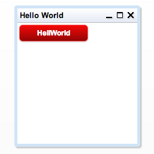

#QAFE Book


## 3. QAFE Basics

### Starting point: application-config.xml

In the previous chapter the software for QAFE Development was installed. Then a simple project project was created and the QAFE HelloWorld application was shown at runtime.

In this chapter we’ll dive into the anatomy of the QAFE HelloWorld Application.

First of all, all the applications are defined in the

```
/WEB-INF/application-config.xml
```
This the qafe default application-config.xml location, but can be specified to any location from the /WEB-INF/web.xml

The contents on the file can be something like this:

```XML
<applications  xmlns=http://qafe.com/schema
xmlns:xsi=http://www.w3.org/2001/XMLSchema-instance xsi:schemaLocation="http://qafe.com/schema
http://www.qafe.com/schema/application-context.xsd">

  <application name="apps" id="system_app" >
    <application-mapping-file location="qafe-default-system-app.qaml"/>
  </application>


  <application name="Hello World" id="myApp" >
    <application-mapping>
       <presentation-tier>
         <view>
          <window id="myWindow" displayname="Hello World">
            <rootpanel>
              <verticallayout>
           	   <button id="myButton" displayname="HellWorld"/>
           	 </verticallayout>
            </rootpanel>
          </window>
        </view>
      </presentation-tier>
    </application-mapping>
  </application>

</applications>
```


The applications that are needed are specified within the application tag in the XML. The application tag has an **id** and **name** attribute. The name attribute is shown in the system application menu shown in the "web" desktop page/qafe landing page which is used to invoke the application. The definition of the application is done within the application-mapping tag.
> The **id** must be unique over all the applications defined in the *application-config.xml*

In the code sample, there are in two applications: *system_app* and *myApp*. The xml file mentioned as attribute value in the *application-mapping-file* tag with the id *system_app* represents the system application menu.

> We call the reference to an *application-mapping-file* a **QAML** file (pronounced as "kamel" file) (therefore also extension .qaml)

In this example the qafe-default-system-app.qaml is in fact an application defined in a QAML file.

```XML
<application name="apps" id="system_app" >
  <application-mapping-file location="qafe-default-system-app.qaml"/>
</application>
```

> NOTE: If you don't want to have the files in your WEB-INF directory, you can modify the application-config.xml to other file locations as long as the file is reachable through a valid URL.

In the second application (id="myApp") the application is defined *inline*. This is useful for demos, but we advise to use external QAML files so that you can use version management on top of it.

### The Anatomy of the application

In the introduction and architecture chapter, this was shown:


Every application starts with *application-mapping* tag, since the whole application definition will be mapped in this structure.

See in the image the *Presentation-tier*.This is the layer responsible for the output in the browser.

In the code sample of HelloWorld, this layer is represented as tag (see second tag)

```XML
<application-mapping>
   <presentation-tier>
     <view>
      <window id="myWindow" displayname="Hello World">
        <rootpanel>
          <verticallayout>
            <button id="myButton" displayname="HellWorld"/>
          </verticallayout>
        </rootpanel>
      </window>
    </view>
  </presentation-tier>
</application-mapping>
```

For this sample application we have a view and in there a *window*. This is exactly what it means: It will become a window in the application.
This application show a window with in there a button with the label "Helloworld".




We'll dive into the details of the application itself in the following chapters.

> Important to understand is that each layer of the architecture will be a tag or portion in the QAML file
