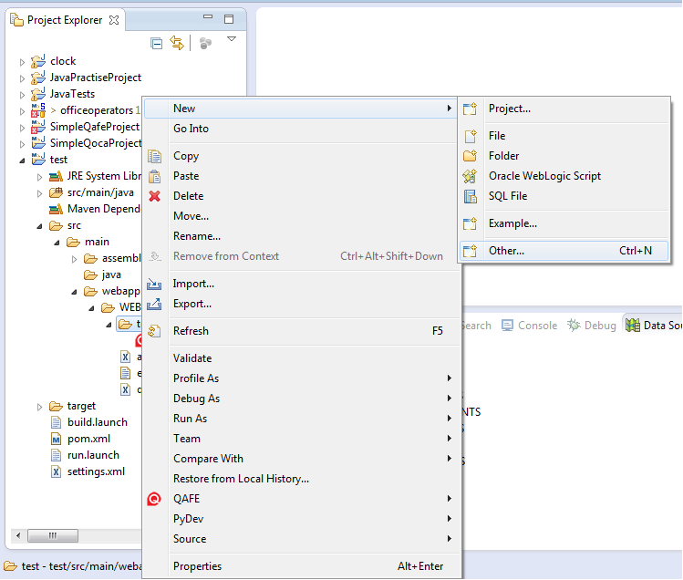

#QAFE Book

## 5. QAFE One Click Application

### 5.1 Building a web application to access a database with a few clicks

In this chapter we will create a web application to access and modify data from a database. Using QAFE, building such an application is easy.

### 5.2 Create a database connection

In chapter 2 and 3 is described how to set up QAFE and how to create a QAFE project.
The next step is to create a database connection. This is done in the Data Source Explorer-view. If this view is not visible go to: `Window` -> Choose `Show View` -> Choose `Other...` -> search and select the Data Source Explorer view.
In the Data Source Explorer-view right click the Database Connections and select new. The New Connection Profile wizard will take you through the process of setting up a new database connection.

### 5.3 Create a new window

Go to the Project Explorer and right click the folder of your application within the WEB-INF-folder. Select: `New` -> `Other...`
Select QAML File from the list.

Use the wizard to set up your new QAML file.
Open the file and go to the UI-tab.
In the top right click the `Window` button.
Enter the window id and the display name.
Drag the table you want to edit from your Data Source Explorer and drop it into your newly created window.
Click OK when asked to save the changes.

A new wizard is started to set up your application.
The wizard will ask you to specify the different locations for each tier (presentation tier, business tier, integration tier and resource tier). You can insert all tiers in the same file, but this is however generally not recommended. For this example, it is fine to use the same QAML-file for all tiers, since the amount of code is still manageable.
Within the resource tier you will have to specify the file in which the SQL statements are stored. This has to be an XML-file.

After the resource tier you will be asked to fill in the file names and Service Ids of the integration and business tier.
Finally you will be asked to define Service Methods.

In this window you will be asked to set up your window. Select the table that you want to use in the top left.
Indicate which view you want to use (form or list). The form view will show only one record from the database.

The list view will show a number of records and a data overflow at the bottom.

The number of columns indicate how many columns you want in your form view or in your data overflow. This number has to be a multitude of 2 since the labels for each field are also considered as columns.

When you have selected the form view you also need to specify how many records are shown on one page by setting the number of rows.

Select the data that you want to show in you application by checking the columns. Note that you need to include the primary key(s) of your table in your form view or your data overflow. This primary key data is needed in order to be able to update the database.

When you are done click apply and finish the wizard.

An UI preview is shown of the window that you just created. You can adjust it to improve the layout.

### 5.4 Building and running your application

Now you can build and run your application as shown in [chapter 2](02_GettingStarted.md).

### 5.5 Using master-detail relations

Linking several tables in a master-detail relation is very simple with QAFE. The procedure is similar to building the application for a single table. Once you have created the window you have to select all the tables that you want to use and drag them into the newly created window.

In the Service Methods window you can indicate the master detail relations. See the example below, here we have one master table and two detail tables.

It is best to start with the master window and configure this one first. After that you configure the first detail table. In the section `Master Relation` you indicate which column is used to link the tables. In our example the DetailEMPLOYEES list is made up of all employees for which the `DEPARTMENT_ID` is the same as the `DEPARTMENT_ID` of the department that is selected in the `detailDEPARTMENTS` table.

Our example application will look like this:

