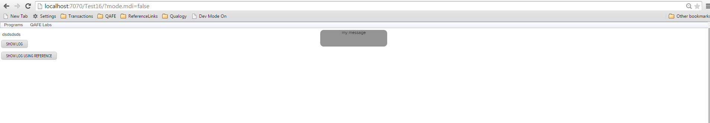

#QAFE Book


### Show Temporary Messages to User

Log built-in can be used to show messages to the end user for a short time.



QAML-file with Log built-in:
```xml
<?xml version="1.0" encoding="UTF-8" standalone="yes"?>
<application-mapping xmlns="http://qafe.com/schema"
	xmlns:xsi="http://www.w3.org/2001/XMLSchema-instance"
	xsi:schemaLocation="http://qafe.com/schema http://www.qafe.com/schema/application-mapping.xsd">
	<presentation-tier>
		<view>
			<window id="logTestWindow" displayname="">
				<rootpanel id="logTest_RootPanel" name="RootPanel"
					class="gwt-DecoratedPanel">
					<verticallayout>
						<label id="xxx" displayname="Some Text here"/>
						<button id="showLogButton" displayname="Show Log"/>
						<button id="showLogButtonWithReference" displayname="Show Log Using Reference"/>
					</verticallayout>
				</rootpanel>
				<events>
					<event >
						<listeners>
							<listenergroup>
								<component ref="showLogButton"/>
								<listener type="onclick"/>
							</listenergroup>
						</listeners>
						<log delay="4000" >
							<message value="my message"></message>
						</log>
					</event>
					<event >
						<listeners>
							<listenergroup>
								<component ref="showLogButtonWithReference"/>
								<listener type="onclick"/>
							</listenergroup>
						</listeners>
						<store name="x" value="dynamic value"></store>
						<log delay="4000" style="" >
							<message ref="x"></message>
						</log>

						<!-- <log delay="4000" class="myLogStyleClass" >
							<message value="Hi ${x}"></message>
						</log> -->

					</event>
				</events>
			</window>
		</view>
	</presentation-tier>
</application-mapping>

```

CSS class used by default for styling the Log message
```
.qmessagebox {
  width: 200px;
  height: 20px;
  background-color: yellow;
  -moz-border-radius: 10px;
  -webkit-border-radius: 10px;
  border: 1px solid #ffa500;
  text-align: center;
}

.qmessageboxlabel {
  text-align: center;
}
```

If you want to change the style of all the Log messages shown in the application, you can overwrite these classes with your style.
Add this entry in your custom css file or qafe.less file to show message with grey color instead of the default yellow color.

```
.qmessagebox {
  width: 200px;
  height: 50px;
  background-color: grey;
  -moz-border-radius: 10px;
  -webkit-border-radius: 10px;
  border: 1px solid grey;
  text-align: center;
}

```

To change style on a particular Log action, you can use the style or class attribute of the log built-in.

Example code using custom style class myLogStyleClass:
```
<log delay="4000" class="myLogStyleClass" >
	<message value="Hi ${x}"></message>
</log>
```

Example code using inline style:
```
<log delay="4000" style="height: 50px; background-color: grey;" >
	<message value="Hi ${x}"></message>
</log>
```
